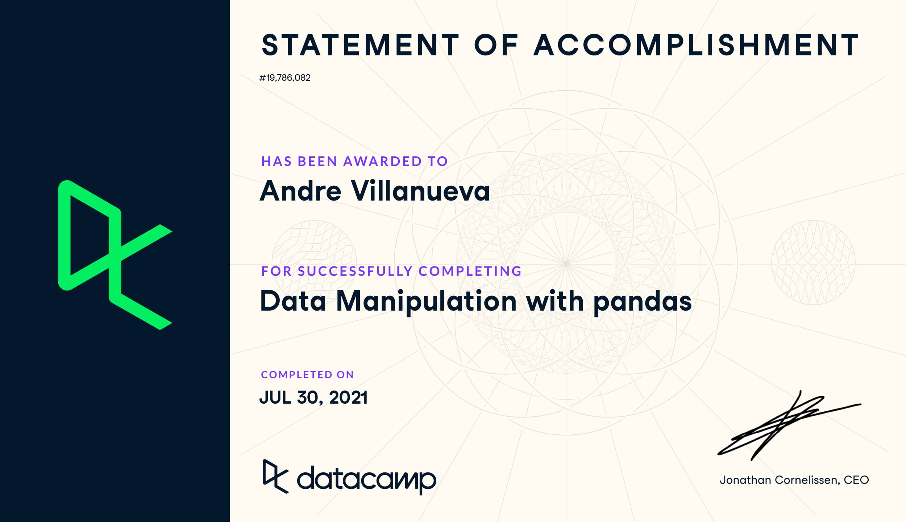

# Data Manipulation with Pandas
### Course Description
pandas is the world's most popular Python library, used for everything from data manipulation to data analysis. In this course, you'll learn how to manipulate DataFrames, as you extract, filter, and transform real-world datasets for analysis. Using pandas you’ll explore all the core data science concepts. Using real-world data, including Walmart sales figures and global temperature time series, you’ll learn how to import, clean, calculate statistics, and create visualizations—using pandas to add to the power of Python!
 
## Transforming Data
- Inspecting a DataFrame
    - df.head()
    - df.info()
    - df.shape
    - df.describe
- Parts of a DataFrame
    - df.values
    - df.columns
    - df.index
- Sorting Rows
    - df.sort_values()   *ascending and descending
- Subsetting columns
    - df[“ “]
- Subsetting rows
    - df[df[“ “] > 60]
    - df[df[“ “] == “ “]
- Subsetting rows by categorical values
    - x = df[" "].isin( )
- Adding new columns
## Summary Statistics
- Mean and Median
    - df[“ “].mean( )
    - df[“ “].median( )
- Min and Max
    - df[“ “].min( )
    - df[“ “].max( )
- Agg method
    - df[“column”].agg(function)
- Cumulative Statistics
    - sales_1_1["cum_weekly_sales"] = sales_1_1["weekly_sales"].cumsum()
    - sales_1_1['cum_max_sales']  = sales_1_1["weekly_sales"].cummax()
- Dropping Duplicates
    - df.drop_duplicates(subset=”name”)
    - df.drop_duplicates(subset=[”name”, “breed”])
- Counting categorical variables
    - df[“breed”].value_counts( )
    - df[“breed”].value_counts( ).value_counts(sort=True)
- Group Statistics
    - Check PDF
- Pivot Tables
    - Alternative to .groupby( )
    - df.pivot_table( )
 
## Slicing and Indexing
- Setting and removing indexes
    - df.set_index(" ")
    - df.reset_index()
    - df.reset_index(drop = True)
- Subsetting with .loc[ ]
    - df.loc[ ]
- Setting multi-level indexes
- Sorting by index values
    - df.sort_index(level=["country", "city"], ascending=[True, False])
- Slicing index values
    - df_srt= df.sort_index()
    - df_srt.loc[" " : " "]
- Slicing in both directions
- Slicing time series
- Subsetting by row/column number
- Working with pivot tables
    - dataframe["column"].dt.component
    - index = rows, columns = columns
## Creating and Visualizing Dataframes
- Bar graph
    - nb_sold_by_size.plot(kind="bar")
- Line graph
    - nb_sold_by_date.plot()
- Scatterplot
    - avocados.plot(x="nb_sold", y="avg_price", kind="scatter", title="Number of avocados sold vs. average price")
- Multiple plots
- Finding missing values
    - print(avocados_2016.isna())
    - print(avocados_2016.isna().any())
    - avocados_2016.isna().sum().plot(kind="bar")
- Removing missing values
    - avocados_complete = avocados_2016.dropna()
- Replacing missing values
    - avocados_filled = avocados_2016.fillna(0)
- Creating DataFrames
- Dictionary of lists
- DataFrame to CSV
