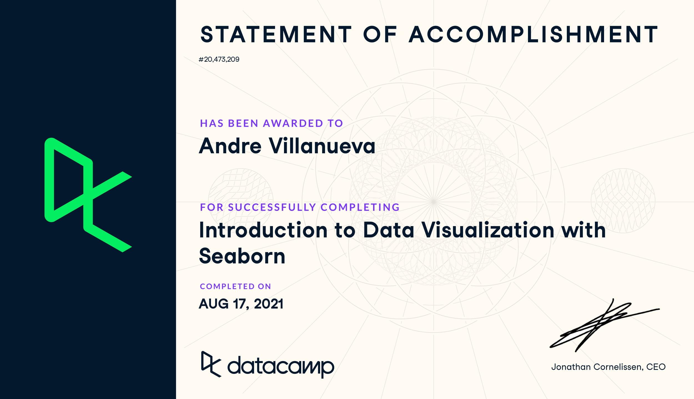

# Introduction to Data Visualization with Seaborn
### Course Description
Seaborn is a powerful Python library that makes it easy to create informative and attractive visualizations. This course provides an introduction to Seaborn and teaches you how to visualize your data using plots such as scatter plots, box plots, and bar plots. You’ll do this while exploring survey responses about student hobbies and the factors that are associated with academic success. You’ll also learn about some of Seaborn’s advantages as a statistical visualization tool, such as how it automatically calculates confidence intervals. By the end of the course, you will be able to use Seaborn in a variety of situations to explore your data and effectively communicate the results of your data analyses to others.

## Introduction to Seaborn
What is Seaborn, and when should you use it? In this chapter, you will find out! Plus, you will learn how to create scatter plots and count plots with both lists of data and pandas DataFrames. You will also be introduced to one of the big advantages of using Seaborn - the ability to easily add a third variable to your plots by using color to represent different subgroups.

- Making a scatter plot with lists
    - sns.scatterplot(x=gdp, y=percent_literate)
    - plt.show()
- Making a count plot with a list
    - sns.countplot(y=region)
    - plt.show()
- Making a count plot with a DataFrame
- Hue and scatter plots
    - sns.scatterplot(x="absences", y="G3", 
                data=student_data, 
                hue="location", hue_order=['Rural', 'Urban'])
- Hue and count plots
    - palette_colors = {"Rural": "green", "Urban": "blue"}
    - sns.countplot(x="school", data=student_data, hue="location", palette=palette_colors)

## Visualizing Two Quantitative Variables
In this chapter, you will create and customize plots that visualize the relationship between two quantitative variables. To do this, you will use scatter plots and line plots to explore how the level of air pollution in a city changes over the course of a day and how horsepower relates to fuel efficiency in cars. You will also see another big advantage of using Seaborn - the ability to easily create subplots in a single figure!

- Creating subplots with col and row
    - sns.relplot(x="absences", y="G3", 
            data=student_data,
            kind="scatter", 
            col="study_time",row="study_time")
- Creating two-factor subplots
    - sns.relplot(x="G1", y="G3", 
            data=student_data,
            kind="scatter", 
            col="schoolsup",
            col_order=["yes", "no"],           row="famsup", 
            row_order=["yes","no"])
- Changing the size of scatter plot points
    - sns.relplot(x="horsepower", y="mpg", 
            data=mpg, kind="scatter", 
            size="cylinders", hue="cylinders"
- Interpreting line plots
    - sns.relplot(x="model_year", y="mpg", kind="line", data=mpg)
- Visualizing standard deviation with line plots
    - sns.relplot(x="model_year", y="mpg",
            data=mpg, kind="line", ci="sd")
- Plotting subgroups in line plots
    - sns.relplot(x="model_year", y="horsepower", 
            data=mpg, kind="line", 
            ci=None, style="origin", 
            hue="origin", markers=True, dashes=False)

## Visualizing a Categorical and a Quantitative Variable
Categorical variables are present in nearly every dataset, but they are especially prominent in survey data. In this chapter, you will learn how to create and customize categorical plots such as box plots, bar plots, count plots, and point plots. Along the way, you will explore survey data from young people about their interests, students about their study habits, and adult men about their feelings about masculinity.
- Count plots
    - sns.catplot(y="Internet usage", data=survey_data,
            kind="count", col="Age")
- Bar plots with percentages
    - sns.catplot(x="Gender", y="Interested in Math", data=survey_data, kind="bar")
- Customizing bar plots
    - sns.catplot(x="study_time", y="G3",
            data=student_data,
            kind="bar",
            order=["<2 hours", 
                   "2 to 5 hours", 
                   "5 to 10 hours", 
                   ">10 hours"],
              ci=None)
- Create and interpret a box plot
    - sns.catplot(x="study_time", y="G3", data=student_data, order=study_time_order, kind="box")
- Omitting outliers
    - sns.catplot(x="internet", y="G3", data=student_data, kind="box", col="location", hue="location", sym="")
- Adjusting the whiskers
    - sns.catplot(x="romantic", y="G3",
            data=student_data,
            kind="box", whis=0.5)
    - sns.catplot(x="romantic", y="G3",
            data=student_data,
            kind="box",
            whis=[5,95])
    - sns.catplot(x="romantic", y="G3",
            data=student_data,
            kind="box",
            whis=[0, 100])
- Customizing point plots
    - sns.catplot(x="famrel", y="absences",
			data=student_data,
            kind="point", capsize=0.2)
    - sns.catplot(x="famrel", y="absences",
			data=student_data,
            kind="point",
            capsize=0.2, join=False)
- Point plots with subgroups
    - sns.catplot(x="romantic", y="absences",
			data=student_data,
            kind="point",
            hue="school",
            ci=None, estimator=median)

## Customizing Seaborn Plots
In this final chapter, you will learn how to add informative plot titles and axis labels, which are one of the most important parts of any data visualization! You will also learn how to customize the style of your visualizations in order to more quickly orient your audience to the key takeaways. Then, you will put everything you have learned together for the final exercises of the course!
- Changing style and palette
    - sns.set_style("whitegrid")
    - sns.set_palette("Purples")
- Changing the scale
    - sns.set_context("poster")
    - sns.set_context("paper")
    - sns.set_context("notebook")
    - sns.set_context("talk")
- Using a custom palette
    - sns.set_palette(["#39A7D0", "#36ADA4"])
- Adding a title to a FacetGrid object
    - g.fig.suptitle("Car Weight vs. Horsepower")
- Adding a title and axis labels
    - g.set(xlabel="Car Model Year", ylabel="Average MPG")
    - g.set_title("Average MPG Over Time")
- Rotating x-tick labels
    - plt.xticks(rotation=90)
- Box plot with subgroups
