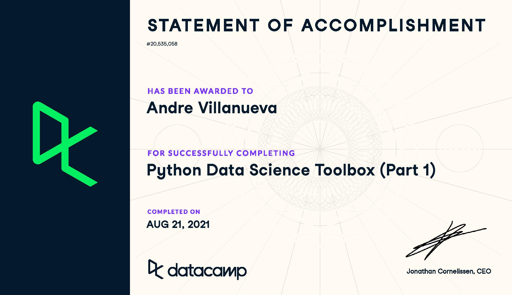

# Python Data Science Toolbox (Part 1)
### Course Description
It's time to push forward and develop your Python chops even further. There are tons of fantastic functions in Python and its library ecosystem. However, as a data scientist, you'll constantly need to write your own functions to solve problems that are dictated by your data. You will learn the art of function writing in this first Python Data Science Toolbox course. You'll come out of this course being able to write your very own custom functions, complete with multiple parameters and multiple return values, along with default arguments and variable-length arguments. You'll gain insight into scoping in Python and be able to write lambda functions and handle errors in your function writing practice. And you'll wrap up each chapter by using your new skills to write functions that analyze Twitter DataFrames.

## Writing your own functions
In this chapter, you'll learn how to write simple functions, as well as functions that accept multiple arguments and return multiple values. You'll also have the opportunity to apply these new skills to questions commonly encountered by data scientists.

## Default arguments, variable-length arguments and scope
In this chapter, you'll learn to write functions with default arguments so that the user doesn't always need to specify them, and variable-length arguments so they can pass an arbitrary number of arguments on to your functions. You'll also learn about the essential concept of scope.

## Lambda functions and error-handling
Learn about lambda functions, which allow you to write functions quickly and on the fly. You'll also practice handling errors in your functions, which is an essential skill. Then, apply your new skills to answer data science questions.