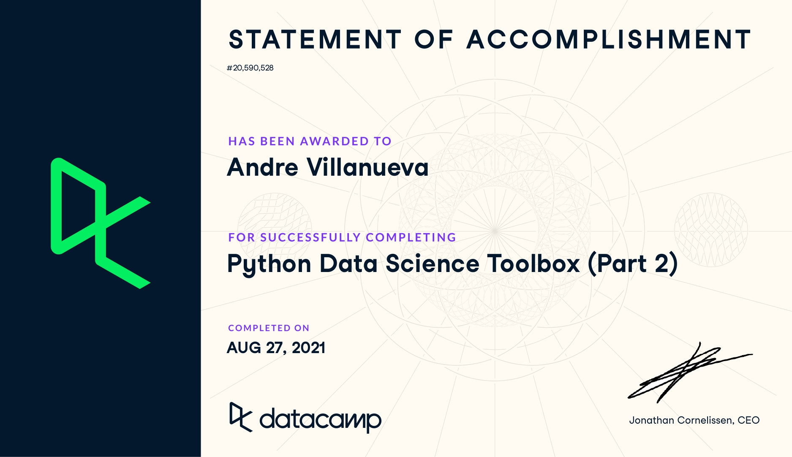

# Python Data Science Toolbox (Part 2)
### Course Description
In this second Python Data Science Toolbox course, you'll continue to build your Python data science skills. First, you'll learn about iterators, objects you have already encountered in the context of for loops. You'll then learn about list comprehensions, which are extremely handy tools for all data scientists working in Python. You'll end the course by working through a case study in which you'll apply all the techniques you learned in both parts of this course.

## Using iterators in PythonLand
You'll learn all about iterators and iterables, which you have already worked with when writing for loops. You'll learn some handy functions that will allow you to effectively work with iterators. And you’ll finish the chapter with a use case that is pertinent to the world of data science and dealing with large amounts of data—in this case, data from Twitter that you will load in chunks using iterators.

## List comprehensions and generators
In this chapter, you'll build on your knowledge of iterators and be introduced to list comprehensions, which allow you to create complicated lists—and lists of lists—in one line of code! List comprehensions can dramatically simplify your code and make it more efficient, and will become a vital part of your Python data science toolbox. You'll then learn about generators, which are extremely helpful when working with large sequences of data that you may not want to store in memory, but instead generate on the fly.

# Bringing it all together!
This chapter will allow you to apply your newly acquired skills toward wrangling and extracting meaningful information from a real-world dataset—the World Bank's World Development Indicators. You'll have the chance to write your own functions and list comprehensions as you work with iterators and generators to solidify your Python data science chops.

