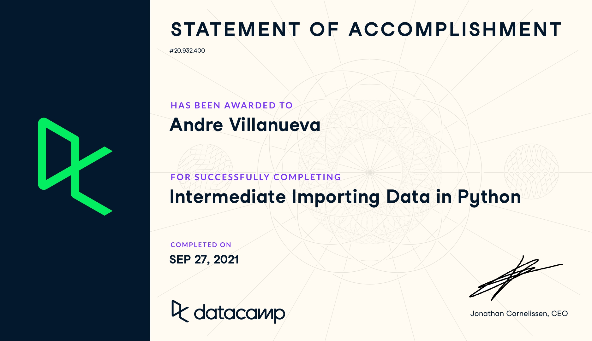

# Intermediate Importing Data in Python
### Course Description
As a data scientist, you will need to clean data, wrangle and munge it, visualize it, build predictive models and interpret these models. Before you can do so, however, you will need to know how to get data into Python. In the prequel to this course, you learned many ways to import data into Python: from flat files such as .txt and .csv; from files native to other software such as Excel spreadsheets, Stata, SAS, and MATLAB files; and from relational databases such as SQLite and PostgreSQL. In this course, you'll extend this knowledge base by learning to import data from the web and by pulling data from Application Programming Interfaces— APIs—such as the Twitter streaming API, which allows us to stream real-time tweets.

## Importing data from the Internet
The web is a rich source of data from which you can extract various types of insights and findings. In this chapter, you will learn how to get data from the web, whether it is stored in files or in HTML. You'll also learn the basics of scraping and parsing web data.

## Interacting with APIs to import data from the web
In this chapter, you will gain a deeper understanding of how to import data from the web. You will learn the basics of extracting data from APIs, gain insight on the importance of APIs, and practice extracting data by diving into the OMDB and Library of Congress APIs.

## Diving deep into the Twitter API
In this chapter, you will consolidate your knowledge of interacting with APIs in a deep dive into the Twitter streaming API. You'll learn how to stream real-time Twitter data, and how to analyze and visualize it.